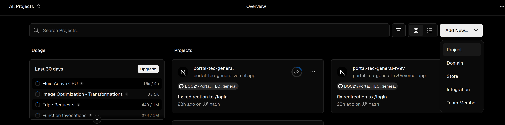
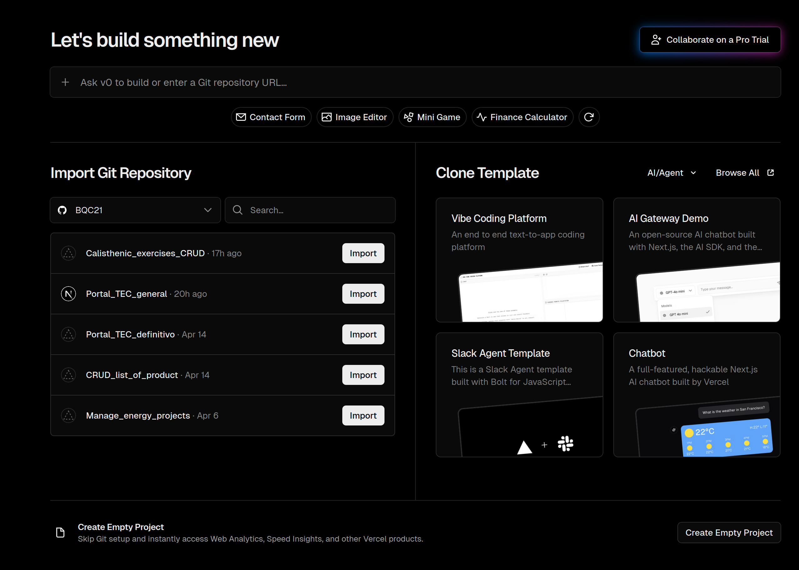
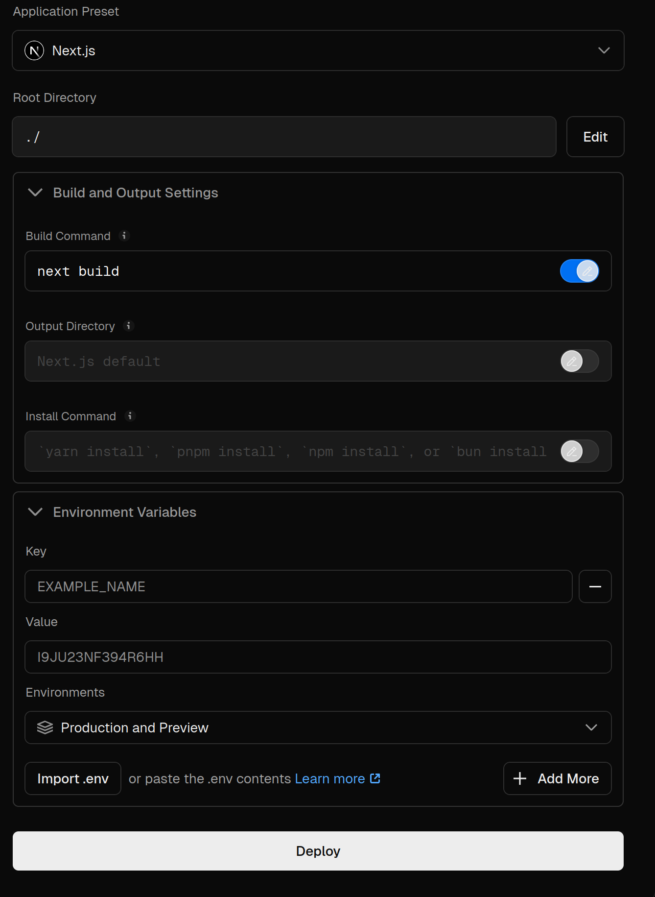

# Portal_TEC_general
Se desarrolla un portal corporativo empresarial que será desplegada en un sitio web con el fin de agilizar el proceso de dimensionamiento y cotización de proyectos diseñados con sistemas solares fotovoltaicos.

## Características
- [x] Módulo 1: Base de datos de productos eléctricos importados
- [ ] Módulo 2: Dimensionamiento del sistema solar FV 
- [ ] Módulo 3: Distribución de costos por proyecto
- [ ] Módulo 4: Generación de informes de cotización por proyecto
- [ ] Módulo 5: Generación de informes financieros por proyecto

<!-- En la página principal, se muestra el tablero donde se registra, en base a los 5 módulos, los productos almacenados, la cantidad de proyectos en curso y las cotizaciones almacenadas. -->

## Stack
1. Supabase: alojamiento de la base de datos
2. Next.js: framework para desarrollar la plataforma
3. React.js: librería de Next.js para gestionar componentes de visualización
4. PostgreSQL: motor SQL incrustado en Supabase
5. TailwindCSS: librería para estilización
6. API de la sunat (https://apis.net.pe/api-tipo-cambio.html): integración del tipo de cambio (USD -> PEN)
7. Vercel: alojamiento de la apliación desarrollada en Next.js

## Autenticación
El portal usa Supabase Auth para controlar el acceso a las rutas internas. La entrada pública queda en `/login`, mientras que `/dashboard`,`/products` y el resto de módulos requieren sesión activa.

Variables requeridas en `.env.local`:

- `NEXT_PUBLIC_SUPABASE_URL` -> enlace URL de Supabase correspondiente al proyecto
- `NEXT_PUBLIC_SUPABASE_PUBLISHABLE_KEY` -> clave TOKEN de Supabase correspondiente al proyecto
- `SUNAT_API_TOKEN` -> TOKEN de la SUNAT, revisar el enlace de https://decolecta.gitbook.io/docs/servicios/integrations 

---

## Requisitos previos

- Git
- Node.js 20+ (incluye npm)

## Instalación y prueba en desarrollo

1. Clonar el repositorio en el nuevo escritorio:

```bash
git clone <URL_DEL_REPOSITORIO>
cd Portal_TEC_general
```

2. Instalar dependencias:

```bash
npm install
```

3. Crear variables de entorno:


Si `.env.local` no existe, créelo manualmente y añada las claves necesarias para Supabase (por ejemplo, `NEXT_PUBLIC_SUPABASE_URL` y `NEXT_PUBLIC_SUPABASE_ANON_KEY`).

4. Ejecute el servidor de desarrollo:

```bash
npm run dev
```

5. Abra la aplicación en su navegador:

```text
http://localhost:3000
```

## Despliegue 

1. Dentro del portal principal, hacer click en `Add New` -> `project`


2. Seleccionar el proyecto alojado en github a importarse, para este caso `Portal_TEC_general`


3. Configurar el despliegue

- `Root Directory` -> se escogió la carpeta raíz
- `Build command` -> next build
- `Output Directory` -> Next.js Default
- `Install Command` -> npm install
- Variables de entorno
  - `NEXT_PUBLIC_SUPABASE_URL` 
  - `NEXT_PUBLIC_SUPABASE_PUBLISHABLE_KEY`
  - `SUNAT_API_TOKEN` 

---

**Nota**: Este proyecto utiliza Supabase como backend. Asegúrese de que su archivo `.env.local` contenga credenciales válidas de Supabase antes de iniciar la aplicación.